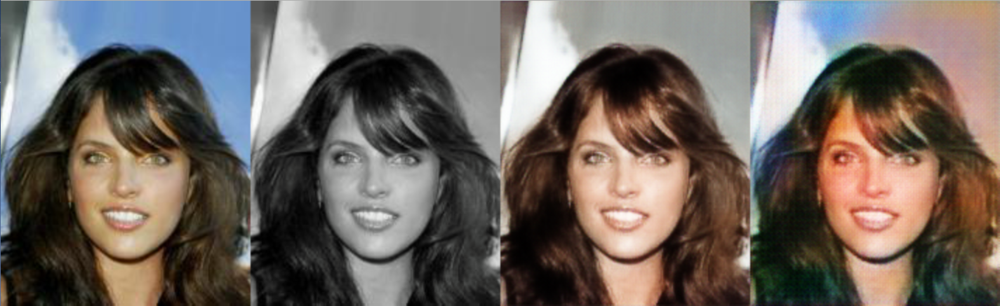

# ColorizationGAN

This project aims to colorize grayscale images using Generative Adverserial Networks (GANs). We are comparing GAN and ConvNet. It is currently in progress.

Results to date:

From left to right : Original color image, grayscale image (input), ConvNet output, GAN output
